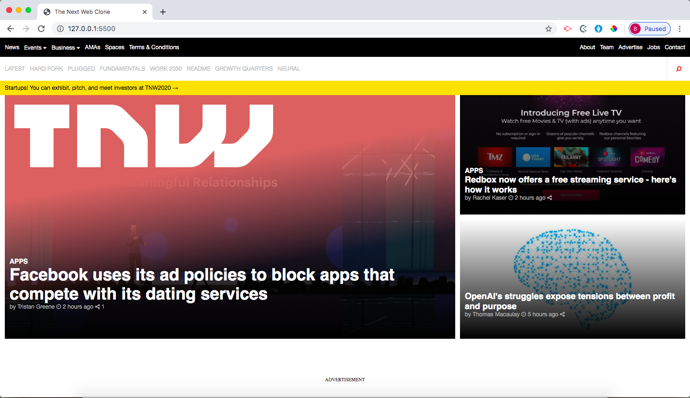

# the-next-web-clone

# What it does
This project consists of replicating the <a href="https://thenextweb.com">The Next Web website</a> putting emphasis on how it behaves differently depending on the size of the screen where the website is rendered.

## Built With
- HTML
- CSS
#### and deployed to Github

## Live Demo

[Live Demo](https://raw.githack.com/Buyaki01/the-next-web-clone/feature/index.html)

## Getting Started

To get a local copy up and running follow these simple example steps.
- Clone the project unto your local machine
- `cd` into the project directory
- Open up index.html in your browser to view the project

## Authors

👤 **Brittany Blake**

- Github: [@BrittanyBlake](https://github.com/BrittanyBlake)
- Twitter: [@bbcodes_](https://twitter.com/bbcodes_)
- Linkedin: [Brittany Blake](https://www.linkedin.com/in/brittany-blake-843951109/)

👤 **Ritta Buyaki**

- Github: [@Buyaki01](https://github.com/Buyaki01)
- Twitter: [@BuyakiRitta](https://twitter.com/BuyakiRitta)
- Linkedin: [Ritta Buyaki](https://www.linkedin.com/in/ritta-buyaki-b12904128/)

## 🤝 Contributing

Feel free to check the [issues page](https://github.com/Buyaki01/the-next-web-clone/issues).

## Attributions and Credit
Special thanks to Microverse!

## Show your support

Give a ⭐️ if you like this project!

## 📝 License

This project is licensed by Microverse.

### Enjoy!